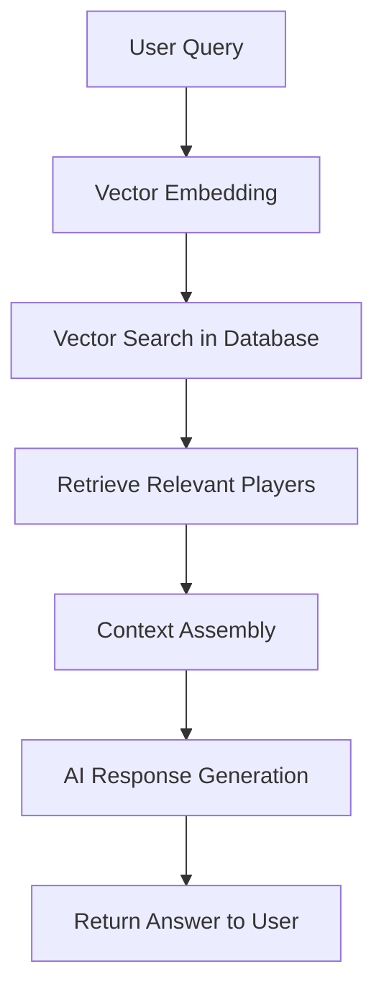
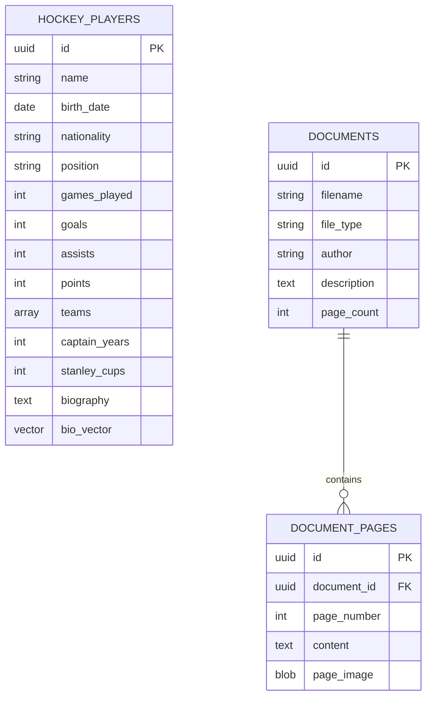

<div align="center">

# 🏒 Hockey Player Information System 🏒

[](https://opensource.org/licenses/MIT)
[](https://www.python.org/downloads/)
[](https://openai.com/)
[](https://supabase.io/)


A comprehensive system for managing and querying hockey player data using vector search and AI capabilities.

</div>

---

## 📋 Overview

This project combines multiple technologies to create a powerful hockey player information system:

- **Data Storage**: Supabase for database storage with PostgreSQL vector search capabilities
- **AI Integration**: OpenAI API for natural language understanding and embeddings
- **Retrieval Augmented Generation (RAG)**: LangChain implementation for context-aware answers
- **Document Management**: Tools for processing and storing documents

## ✨ Features

- 🔍 **Vector Search**: Find hockey players based on similarity to natural language queries
- 🤖 **Intelligent Responses**: Get detailed information about hockey legends using AI-powered answers
- 📄 **Document Processing**: Upload and manage related documents with automatic page processing
- 📊 **Data Loading Utilities**: Tools for populating the database from various sources

## 🏗️ Core Components

### Hockey Player Database

Contains detailed information about legendary hockey players including:
- 📊 Career statistics
- 📜 Biographical information 
- 🏆 Team affiliations
- 🥇 Achievement records

### RAG Implementation

The system uses Retrieval Augmented Generation to:
1. Convert user queries into vector embeddings
2. Find relevant player information in the database
3. Generate contextually accurate responses based on retrieved information

<div align="center">
  


</div>

### Document Management

Process various document types:
- 📑 PDF document processing and storage
- 📝 Page-by-page analysis
- 🏷️ Metadata extraction

## 🚀 Setup Instructions

### Prerequisites

- Python 3.8+
- Supabase account and project
- OpenAI API key

### Environment Configuration

Create a `.env` file with the following variables:

```bash
SUPABASE_URL=your_supabase_url
SUPABASE_KEY=your_supabase_key
OPENAI_API_KEY=your_openai_api_key
```

### Installation

1. Clone the repository
   ```bash
   git clone https://github.com/yourusername/hockey-player-system.git
   cd hockey-player-system
   ```

2. Install dependencies:
   ```bash
   pip install -r requirements.txt
   ```

3. Run the database setup scripts:
   ```bash
   python scripts/setup_database.py
   ```

4. Generate embeddings for vector search:
   ```bash
   python scripts/generate_embeddings.py
   ```

## 📘 Usage

### Player Information Query

Run the interactive query tool:

```bash
python query_players.py
```

This allows you to ask questions about hockey players using natural language.

<div align="center">
  
```
🏒 Hockey Player Information System 🏒
--------------------------------
Ask a question about hockey players: Who was the highest scoring defenseman?

Top Matches:
Player: Bobby Orr, Similarity: 0.8754
...

ANSWER:
Based on the provided context, Bobby Orr was the highest scoring defenseman...
```

</div>

### Document Management

Process and store documents:

```bash
python document_manager.py
```

### Voice Output (Optional)

Generate audio responses:

```bash
python text_to_speech.py
```

## 💾 Database Schema

<div align="center">
  


</div>

The primary tables include:

- `hockey_players`: Player information and embeddings
- `documents`: Document metadata
- `document_pages`: Individual document pages and content

## 🤝 Contributing

Contributions are welcome! Please feel free to submit a Pull Request.

1. Fork the repository
2. Create your feature branch (`git checkout -b feature/amazing-feature`)
3. Commit your changes (`git commit -m 'Add some amazing feature'`)
4. Push to the branch (`git push origin feature/amazing-feature`)
5. Open a Pull Request

## 📜 License

This project is licensed under the MIT License - see the LICENSE file for details.

## 👏 Acknowledgements

- Hockey player data sourced from public records
- Built with LangChain, OpenAI, and Supabase technologies

<div align="center">
  
---

Made with ❤️ by Akhila Chowdary Kongara

</div>
